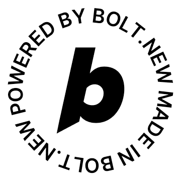

# 🔬 OwnBioScan - At-Home Health Diagnostics



🏠 Turn your smartphone into a personal health lab with AI-powered diagnostics at home. Test, analyze, and monitor your health anytime, anywhere.

---

## 📋 Table of Contents

*   [🎯 About the Project](#-about-the-project)
*   [✨ Features](#-features)
*   [🛠️ Technologies Used](#️-technologies-used)
*   [🚀 Getting Started](#-getting-started)
    *   [📋 Prerequisites](#-prerequisites)
    *   [⚙️ Installation](#️-installation)
*   [📱 Usage](#-usage)
*   [📁 Project Structure](#-project-structure)
*   [🤝 Contributing](#-contributing)
*   [📄 License](#-license)
*   [📞 Contact](#-contact)
*   [⚡ Powered by Bolt.new](#-powered-by-boltnew)

---

## 🎯 About the Project

OwnBioScan is a revolutionary web application designed to empower individuals to take control of their health from the comfort of their homes. By leveraging the power of AI 🤖 and smartphone cameras 📱, it enables users to perform cholesterol tests using test strips, analyze the results instantly, and track their health trends over time. The application provides clear interpretations, personalized advice, and the ability to generate comprehensive PDF reports 📊, making health monitoring accessible and convenient for everyone.

This project aims to provide a seamless, intuitive, and reliable experience for at-home health diagnostics, bridging the gap between professional medical testing and everyday life. 🌟

---

## ✨ Features

*   🤖 **AI-Powered Analysis:** Utilize your smartphone camera to scan cholesterol test strips, with advanced AI providing instant and accurate analysis.
*   ⚡ **Real-time Results & Classification:** Get immediate cholesterol readings (mg/dL) and clear classifications (Normal, High, Critical) with confidence scores.
*   📈 **Historical Tracking:** Store and visualize your test history, allowing you to monitor cholesterol trends and evolution over time.
*   📄 **Comprehensive PDF Reports:** Generate and download detailed PDF reports of your test results, including interpretations, reference values, and medical disclaimers, suitable for sharing with healthcare professionals.
*   🎮 **Interactive Demo Mode:** Explore the application's functionality with simulated test strip images, demonstrating various cholesterol levels.
*   🎨 **User-Friendly Interface:** A clean, intuitive, and responsive design ensures a smooth experience across all devices (mobile, tablet, desktop).
*   ♿ **Accessibility Focused:** Built with accessibility best practices in mind, including keyboard navigation, screen reader support, and reduced motion preferences.
*   🔒 **Local Data Storage:** All your health data is stored securely on your device, ensuring privacy and control.

---

## 🛠️ Technologies Used

This project is built with a modern web development stack, focusing on performance, maintainability, and user experience. 💪

*   **Frontend:**
    *   ⚛️ [React](https://react.dev/) - A JavaScript library for building user interfaces.
    *   📘 [TypeScript](https://www.typescriptlang.org/) - A typed superset of JavaScript that compiles to plain JavaScript.
    *   🎨 [Tailwind CSS](https://tailwindcss.com/) - A utility-first CSS framework for rapid UI development.
    *   🎯 [Lucide React](https://lucide.dev/icons/) - A collection of customizable and tree-shakable SVG icons.
    *   🛣️ [React Router DOM](https://reactrouter.com/en/main) - Declarative routing for React applications.
    *   📄 [jsPDF](https://raw.githack.com/MrRio/jsPDF/master/docs/) - A client-side JavaScript library for generating PDFs.
    *   🔤 [@fontsource](https://fontsource.org/) - Self-hosting Google Fonts for consistent typography.

*   **Build Tool:**
    *   ⚡ [Vite](https://vitejs.dev/) - A fast build tool and development server.

*   **Development Tools:**
    *   🔍 [ESLint](https://eslint.org/) - Pluggable JavaScript linter.
    *   🔧 [PostCSS](https://postcss.org/) - A tool for transforming CSS with JavaScript.
    *   🔄 [Autoprefixer](https://github.com/postcss/autoprefixer) - PostCSS plugin to parse CSS and add vendor prefixes.

*   **Browser APIs & Features:**
    *   📷 `navigator.mediaDevices` (Camera Access)
    *   🖼️ HTML Canvas API (Image Processing)
    *   🔊 Web Audio API (for haptic feedback)
    *   👁️ Intersection Observer API (for lazy loading and animations)
    *   📳 Vibration API (for haptic feedback)
    *   💾 Local Storage (for data persistence)

---

## 🚀 Getting Started

To get a local copy of OwnBioScan up and running, follow these simple steps. 🎯

### 📋 Prerequisites

Make sure you have the following installed on your machine:

*   📦 [Node.js](https://nodejs.org/en/) (LTS version recommended)
*   📦 [npm](https://www.npmjs.com/) (Node Package Manager) or [Yarn](https://yarnpkg.com/)

### ⚙️ Installation

1.  **📥 Clone the repository:**

    ```bash
    git clone https://github.com/your-username/ownbioscan.git
    ```

    Replace `your-username` with your actual GitHub username or the organization's name.

2.  **📂 Navigate to the project directory:**

    ```bash
    cd ownbioscan
    ```

3.  **📦 Install dependencies:**

    Using npm:
    ```bash
    npm install
    ```
    Or using Yarn:
    ```bash
    yarn
    ```

4.  **🏃‍♂️ Run the development server:**

    Using npm:
    ```bash
    npm run dev
    ```
    Or using Yarn:
    ```bash
    yarn dev
    ```

    The application will be accessible in your browser at `http://localhost:5173` (or another port if 5173 is in use). 🌐

5.  **🏗️ Build for production (optional):**

    To create a production-ready build of the application:

    Using npm:
    ```bash
    npm run build
    ```
    Or using Yarn:
    ```bash
    yarn build
    ```

    The optimized build files will be generated in the `dist/` directory. 📦

---

## 📱 Usage

OwnBioScan is designed for ease of use. Here's a quick guide on how to use the application: 👨‍⚕️

1.  🏠 **Access the Demo:** Upon launching the application, you'll land on the demo home page. Here, you can choose between "Camera Mode" to use your device's camera or "Demo Mode" to analyze pre-defined simulated test images.
2.  📋 **Sample Collection Guide:** If you choose "Camera Mode" or "Start Test," you'll be guided through a 5-step sample collection process. Follow the instructions carefully for accurate results.
3.  📸 **Capture Your Test Strip:** Use your device's camera to capture an image of your test strip. Ensure good lighting and proper framing as indicated by the on-screen overlay.
4.  🔬 **Analyze & View Results:** The application's AI will instantly analyze the captured image and display your cholesterol value, classification (normal, high, critical), and a confidence score.
5.  📊 **Explore Historical Data:** Navigate to the "Test History" section to view all your past test results, track trends, and see overall statistics.
6.  📄 **Generate PDF Reports:** From the test results page, you can download or open a detailed PDF report of your current test, which includes all relevant information and medical disclaimers.

---

## 📁 Project Structure

The project follows a well-organized structure to ensure maintainability and scalability: 🏗️

```
ownbioscan/
├── 📁 public/                 # Static assets (e.g., images, favicon)
├── 📁 src/
│   ├── 📁 components/         # Reusable React components
│   │   ├── 📁 camera/         # Components specific to camera capture
│   │   ├── 📁 common/         # Generic UI components (e.g., ErrorBoundary, LazyImage)
│   │   ├── 📁 comparison/     # Components for historical data comparison
│   │   ├── 📁 history/        # Components for test history display
│   │   ├── 📁 layout/         # Layout components (Header, Footer)
│   │   ├── 📁 result/         # Components for displaying test results
│   │   ├── 📁 sections/       # Landing page sections
│   │   ├── 📁 ui/             # Core UI elements (Button, Card, ProgressBar, etc.)
│   │   └── 📄 index.ts        # Barrel export for components
│   ├── 📁 data/               # Static data, content, navigation, sample data
│   ├── 📁 hooks/              # Custom React hooks for reusable logic
│   ├── 📁 styles/             # Global styles and design tokens
│   ├── 📁 utils/              # Utility functions (color analysis, PDF generation, storage, accessibility, performance)
│   ├── 📄 App.tsx             # Main application component
│   ├── 📄 main.tsx            # Entry point for React application
│   └── 📄 index.css           # Tailwind CSS imports and custom base styles
├── 📄 .eslintrc.js            # ESLint configuration
├── 📄 postcss.config.js       # PostCSS configuration
├── 📄 tailwind.config.js      # Tailwind CSS configuration
├── 📄 tsconfig.json           # TypeScript configuration
├── 📄 vite.config.ts          # Vite build tool configuration
├── 📄 package.json            # Project dependencies and scripts
└── 📄 README.md               # Project README file
```

---

## 🤝 Contributing

Contributions are welcome! 🎉 If you have suggestions for improvements, new features, or bug fixes, please follow these steps:

1.  🍴 **Fork** the repository.
2.  🌿 **Create** a new branch (`git checkout -b feature/YourFeatureName`).
3.  💾 **Commit** your changes (`git commit -m 'Add: Your new feature'`).
4.  📤 **Push** to the branch (`git push origin feature/YourFeatureName`).
5.  🔄 **Open** a Pull Request.

Please ensure your code adheres to the existing style and passes all linting checks. ✅

---

## 📄 License

This project is licensed under the MIT License - see the `LICENSE` file for details. ⚖️

---

## 📞 Contact

For any questions, suggestions, or support, please reach out: 💬

*   📧 **Email:** support@ownbioscan.com
*   🐛 **GitHub Issues:** [https://github.com/your-username/ownbioscan/issues](https://github.com/your-username/ownbioscan/issues) (Replace `your-username`)

---

## ⚡ Powered by Bolt.new

This project was built with [Bolt.new](https://bolt.new/), a powerful platform for building and deploying web applications. 🚀

<a href="https://bolt.new/" target="_blank" rel="noopener noreferrer" title="Powered by Bolt.new">
  
</a>

The Bolt.new badge is mandatory for all submitted projects and must be clearly visible on the main home page. ✨

---

## 🎯 Key Highlights

- 🏆 **Production-Ready:** Built with modern web standards and best practices
- 🔒 **Privacy-First:** All data stored locally on your device
- 📱 **Mobile-Optimized:** Responsive design for all screen sizes
- ♿ **Accessible:** WCAG compliant with full keyboard navigation
- ⚡ **Fast & Lightweight:** Optimized for performance with lazy loading
- 🎨 **Beautiful UI:** Clean, modern design with smooth animations
- 🧪 **Demo Mode:** Try the app without real test strips
- 📊 **Data Visualization:** Track your health trends over time

---

*Made with ❤️ for better health monitoring at home*